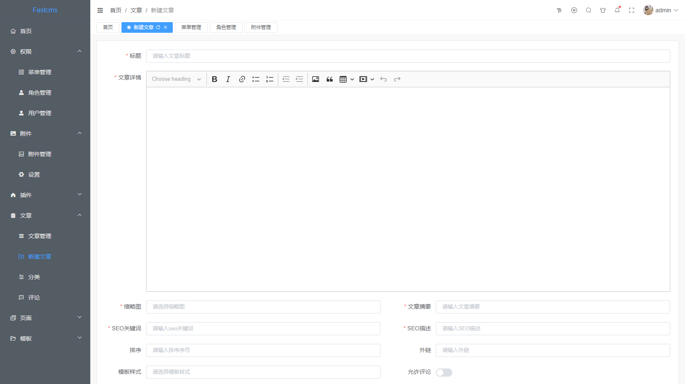

# fastcms

### 介绍
- fastcms内置一套完整的CMS建站系统
- fastcms完全融入微信生态，是一切微信营销插件的基石
- fastcms可以基于jar, zip包动态热插拔
- fastcms基于SpringBoot进行插件式开发，具有极强的扩展性，让你彻底从臃肿的项目中解脱出来

### 文档
- [文档地址](http://doc.xjd2020.com)

### 官网
- [官网地址](https://www.xjd2020.com)

### 安装部署
- [视频教程](https://www.bilibili.com/video/BV12G4y167vi/)

### 本地运行
- 网站访问地址: http://localhost:8080
- 管理后台访问地址： http://localhost:8080/fastcms
- 初始账号密码：admin/1

### Fastcms拼团小程序

### 后端技术
- SpringBoot作为底层框架
- mybatis-plus代码生成，可快速生成模块骨架代码
- 使用spring security jwt进行登录验证，权限控制
- 集成pf4j插件框架，实现插件的jar包的热插拔
- 通过责任链跟访问者模式实现完美的数据权限解决方案

### 前端技术
- vue3
- elementui-plus
- typescript
- vite

### 核心功能
- 完整的用户权限管理
- 插件管理，支持插件的在线安装，卸载，无需重启服务器，安装即可使用
- CMS管理，支持模板的在线安装，卸载，在线编辑模板文件
- 支付功能
- 微信生态支持

### 运行环境
1. jdk1.8+
2. apache maven 3.6+
3. spring-boot 2.6.6+

### 沟通交流
加微信请备注fastcms

